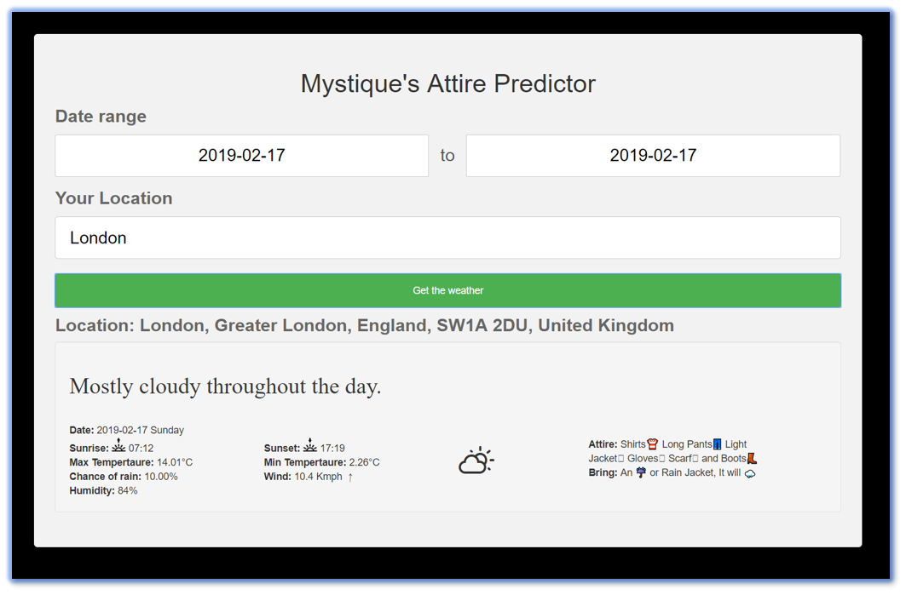

# Predict Attire for Weather

We will use the Dark Sky Weather API to get our weather data. Based on that we will make a prediction on what the attire should for a comfortable outdoor activity.


1. ## Get DarkSky API Key

    - Get your own [DarkSkey API Key](https://darksky.net/dev)

1. ## Setting up the environment

    - Get the application code

        ```bash
        yum -y install git
        git clone https://github.com/miztiik/predict-attire-for-weather.git
        ```

    - Update your API key

        In the file `src/config/prod_config.json` update your `api key`

1. ## Run applicaion on (Amazon) linux Machine

    - Get the application code from git (_from the previous step_)

        ```bash
        cd /var/predict-attire-for-weather
        gunicorn --bind 0.0.0.0:80 wsgi:application --access-logfile - --error-logfile - --capture-output --enable-stdio-inheritance
        ```

1. ## Run as Docker Image

    Assuming you have docker host ready, Run the [Setting up the environment](#setting-up-the-environment) instructions, and then execute the below,

    ```bash
    cd /var/predict-attire-for-weather
    ### Build the image
    docker build --tag="predict-attire-for-weather" .

    ### Run the Image
    docker run -dti -p 80:80 --name attire_recommender predict-attire-for-weather
    ```

1. ## Test the app

    Access the linux server IP/Docker Host IP in your browser, you should be seeing something like this,
    

## Buy me a coffee

Buy me a coffee ☕ through [Paypal](https://paypal.me/valaxy), _or_ You can reach out to get more details through [here](https://youtube.com/c/valaxytechnologies/about).

### References

1. [Source Repo](https://github.com/miztiik/predict-attire-for-weather)

1. [Docker Hub](https://hub.docker.com/r/mystique/predict-attire-for-weather)

### Metadata

**Level**: 300
